# Section 3: Numpy, Pandas, Matplotlib 🔥

## Anaconda

Anaconda is a distribution of software that comes with `conda`, Python, and over 150 scientific packages and their dependencies. The application `conda` is a package and environment manager.

- To install package with specified version number: `conda install numpy=1.10`
- To uninstall a package: `conda remove package_name`
- To update all packages within an environment: `conda update --all`
- To list installed packages: `conda list`
- To search for a package name: `conda search *search_term*`
- To create an environment: `conda create -n env_name list of packages` / `conda create -n py2 python=2`
- To enter an environment: `conda activate my_env`
- To leave an environment: `conda deactivate`
- To save an environment's packages, dependencies and versions to YAML file: `conda env export > environment.yaml`. This file can now be shared and others will be able to create the same environment you used for the project
- To create an environment from an environment file: `conda env create -f environment.yaml`
- To list all created environments: `conda env list`
- To remove an environment: `conda env remove -n env_name`

#### Sharing environments

When sharing on GitHub, it's good practice to commit an environment file to make it easier for people to install all the dependencies.
Ideally also include a pip requirements.txt file using `pip freeze` for people not using conda.

## Jupyter Notebooks

- The notebook is a web application that allows you to combine explanatory text, math equations, code, and visualizations all in one easily sharable document.
- Notebooks have quickly become an essential tool when working with data. You'll find them being used for data cleaning and exploration, visualization, machine learning, and big data analysis.
- Notebooks are just big JSON files with the extension `.ipynb`.
- Notebooks are also rendered automatically on GitHub.
- By default, the notebook server runs at http://localhost:8888.
- You should consider installing Notebook Conda to help manage your environments: `conda install nb_conda`. You will be able to access any of your conda environments when choosing a kernel.
- Refer to `working-with-code-cells.ipynb` for useful tips when working with notebooks.
- [Markdown Cheatsheet](https://github.com/adam-p/markdown-here/wiki/Markdown-Cheatsheet) and [LaTeX Tutorial](https://www.latex-tutorial.com/)
- If you want to time how long it takes for a whole cell to run, you’d use `%%timeit`.
- To render figures directly in the notebook: `%matplotlib inline`
- To turn on the interactive debugger and inspect variables in the current namespace: `%pdb`
- Other [magic commands](https://ipython.readthedocs.io/en/stable/interactive/magics.html)
- To convert notebook into html: `jupyter nbconvert --to html notebook.ipynb`
- To create a slideshow from the notebook file and see it in the browser: `jupyter nbconvert notebook.ipynb --to slides --post serve`

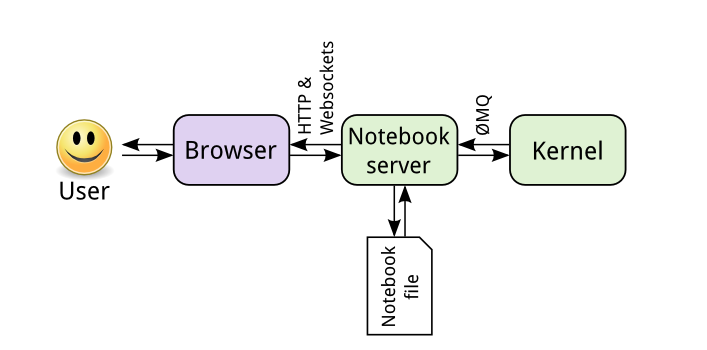

## Numpy

- Check out `numpy arrays.ipynb`

* NumPy stands for Numerical Python and it's a fundamental package for scientific computing in Python. Built on top of C.
* Check out version with `conda list numpy`
* NumPy arrays are several orders of magnitude much faster than regular python lists. This speed comes from the nature of NumPy arrays being memory-efficient and from optimized algorithms used by NumPy for doing arithmetic, statistical, and linear algebra operations.
* Also supports multidimensional arrays to represent vectors and matrices. It is optimized for matrix operations, largely used in ML algorithms.
* Large number of optimized built-in complex mathematical functions.
* Pandas are built on top of Numpy.
* Numpy arrays ndarray -> n-dimensional array. An ndarray is a multidimensional array of elements all of the same type (string or number).
* When we create an ndarray with both floats and integers, NumPy assigns its elements a float64 dtype. This is called **upcasting**. Since all the elements of an ndarray must be of the same type, in this case NumPy upcasts the integers to floats in order to avoid losing precision in numerical computations.
* Specifying the data type of the ndarray can be useful in cases when you don't want NumPy to accidentally choose the wrong data type, or when you only need certain amount of precision in your calculations and you want to save memory.
* Once you create an ndarray, you may want to save it to a file to be read later or to be used by another program: `np.save(filename, array_name)`. To later load it into the notebook: `np.load('array_name.npy')`
* `np.zeros((3,4), dtype=int)`
* `np.ones((3,4), dtype=int)`
* `np.full((4,3), 5)`
* `np.eye(3)`
* `np.diag([10,20,30,40])`
* `np.arange(start, stop, step)`, start is inclusive, stop is exclusive, step is third argument
* `np.linspace(start, stop, N)`, start and stop are both inclusive. Passing in endpoint=False it will exclude the endpoint.
* `np.reshape(ndarray, new_shape)`
* `np.random.random(shape` or `np.random.randint(start, end, shape)`
* NumPy allows you create random ndarrays with numbers drawn from various probability distributions such as: `np.random.normal(mean, standard_deviation, size=shape)`
* To access elements: `array_name[row][column]` or `array_name[row, column]`
* To delete elements: `np.delete(ndarray, elements, axis)`. For rank 2 ndarrays, axis = 0 is used to select rows, and axis = 1 is used to select columns.
* To add elements: `np.append(ndarray, elements, axis)`.
* To insert elements: `np.insert(ndarray, index, elements, axis)`
* Slicing does not create a copy, need to call the copy method.
* To get only unique values: `np.unique(ndarray)`
* To grab diagonally below main diagonal: `np.diag(nparray, k=-1)`
* Sorting: When `np.sort()` is used as a function, it sorts the ndrrays out of place, meaning, that it doesn't change the original ndarray being sorted. However, when you use sort as a method, `ndarray.sort()` sorts the ndarray in place, meaning, that the original array will be changed to the sorted one.
* **Broadcasting** is the term used to describe how NumPy handles element-wise arithmetic operations with ndarrays of different shapes. For example, broadcasting is used implicitly when doing arithmetic operations between scalars and ndarrays. When performing element-wise operations, the shapes of the ndarrays being operated on, must have the same shape or be broadcastable.

- **It is important to remember that one big difference between Python lists and ndarrays, is that unlike Python lists, all the elements of an ndarray must be of the same type.**

## Pandas

* [Official docs](https://pandas.pydata.org/pandas-docs/stable/)
* Check out notebook pandas.ipynb
* Pandas is a package for data manipulation and analysis in Python. Built on top of Numpy.
* Pandas **Series** and Pandas **DataFrames** allow us to work with *labeled* and *relational* data in an easy and intuitive manner
* It often happens that large datasets don’t come ready to be fed into your learning algorithms, will often have missing values, outliers, incorrect values, etc… Having data with a lot of missing or bad values, for example, is not going to allow your machine learning algorithms to perform well. Therefore, one very important step in machine learning is to look at your data first and make sure it is well suited for your training algorithm by doing some basic data analysis.

**Series**

* A Pandas series is a one-dimensional array-like object that can hold many data types, such as numbers or strings. Unlike Numpy ndarrays, you can assign index label to each element and it can hold data of different types.
* Since we can access elements in various ways, in order to remove any ambiguity to whether we are referring to an index label or numerical index, Pandas Series have two attributes, `.loc` and `.iloc` to explicitly state what we mean. The attribute `.loc` stands for location and it is used to explicitly state that we are using a labeled index. Similarly, the attribute `.iloc` stands for integer location and it is used to explicitly state that we are using a numerical index.
* Series are mutable. Delete items in place: `pd.drop(index, inplace=True)`.

**DataFrames**
* We see that DataFrames are displayed in tabular form, much like an Excel spreadsheet. Also notice that the row labels of the DataFrame are built from the union of the index labels of the two Pandas Series we used to construct the dictionary. And the column labels of the DataFrame are taken from the keys of the dictionary.
* Another thing to notice is that the columns are arranged alphabetically and not in the order given in the dictionary. We will see later that this won't happen when we load data into a DataFrame from a data file.
* NaN stands for Not a Number, and is Pandas way of indicating that it doesn't have a value for that particular row and column index. Whenever a DataFrame is created, if a particular column doesn't have values for a particular row index, Pandas will put a NaN value there. If we were to feed this data into a machine learning algorithm we will have to remove these NaN values first.
* To access `dataframe[column][row]`

**Matplotlib and Seaborn**

- Bar charts for qualitative variables
- Histograms for quantitative variables

In short, a **tidy** dataset is a tabular dataset where:

1. each variable is a column
2. each observation is a row
3. each type of observational unit is a table

In practice, you may need to perform tidying work before exploration. You should be comfortable with reshaping your data or perform transformations to split or combine features in your data, resulting in new data columns. This work should be performed in the wrangling stage of the data analysis process.

- Bar Charts
A bar chart is used to depict the distribution of a categorical variable. In a bar chart, each level of the categorical variable is depicted with a bar, whose height indicates the frequency of data points that take on that level.
`sns.countplot(data, x | y, color, order)`. `color_palette()` returns a list of RBG tuples.

- Pie charts
- Interest in relative frequencies. Areas should represent parts of a whole.
- Limit the number of slices plotted.
- Donut plot by setting the wedge width to number smaller than 1.

- Histograms
- Used to plot the distribution of a numeric variable. It's the quantitative version of the bar chart. However, rather than plot one bar for each unique numeric value, values are grouped into continuous bins, and one bar for each bin is plotted depicting the number.
- Use `plt.hist(data=df,x='num_var')` or `sb.distplot()`. The latter creates more bins by default and draws the kernel density estimate (KDE) (area under the curve sum to 1). `kde=False` removes it and equals the Matplotlib one. You can set custom bin edge values with arange.

```
bin_edges = np.arange(0, df['num_var'].max()+1, 1)
plt.hist(data = df, x = 'num_var', bins = bin_edges)
```

Figures, Axes and Subplots

```
plt.figure(figsize = [10, 5]) # larger figure size for subplots
plt.subplot(1, 2, 1) # 1 row, 2 cols, subplot 1
bin_edges = np.arange(0, df['num_var'].max()+4, 4)
plt.hist(data = df, x = 'num_var', bins = bin_edges)

plt.subplot(1, 2, 2) # 1 row, 2 cols, subplot 2
bin_edges = np.arange(0, df['num_var'].max()+1/4, 1/4)
plt.hist(data = df, x = 'num_var', bins = bin_edges)
```
`axes = fig.get_axes()` to get all axes in a figure and `ax=plt.gca()` to get the current axes.
```
fig, axes = plt.subplots(3, 4) # grid of 3x4 subplots
axes = axes.flatten() # reshape from 3x4 array into 12-element vector
for i in range(12):
    plt.sca(axes[i]) # set the current Axes
    plt.text(0.5, 0.5, i+1) # print conventional subplot index number to middle of Axes
```
As you create your plots and perform your exploration, make sure that you pay attention to what the plots tell you that go beyond just the basic descriptive statistics. Note any aspects of the data like number of modes and skew, and note the presence of outliers in the data for further investigation.

`plt.xlim(lower,upper)` to change axes limits.

```
plt.figure(figsize = [10, 5])

# histogram on left: full data
plt.subplot(1, 2, 1)
bin_edges = np.arange(0, df['skew_var'].max()+2.5, 2.5)
plt.hist(data = df, x = 'skew_var', bins = bin_edges)

# histogram on right: focus in on bulk of data < 35
plt.subplot(1, 2, 2)
bin_edges = np.arange(0, 35+1, 1)
plt.hist(data = df, x = 'skew_var', bins = bin_edges)
plt.xlim(0, 35) # could also be called as plt.xlim((0, 35))
```

Certain data distributions will find themselves amenable to scale transformations. The most common example of this is data that follows an approximately log-normal distribution. This is data that, in their natural units, can look highly skewed: lots of points with low values, with a very long tail of data points with large values. However, after applying a logarithmic transform to the data, the data will follow a normal distribution.

```
plt.figure(figsize = [10, 5])

# left histogram: data plotted in natural units
plt.subplot(1, 2, 1)
bin_edges = np.arange(0, data.max()+100, 100)
plt.hist(data, bins = bin_edges)
plt.xlabel('values')

# right histogram: data plotted after direct log transformation
plt.subplot(1, 2, 2)
log_data = np.log10(data) # direct data transform
log_bin_edges = np.arange(0.8, log_data.max()+0.1, 0.1)
plt.hist(log_data, bins = log_bin_edges)
plt.xlabel('log(values)')
```
Or better yet, do the scale transform to keep the natural labels of the x-axis:
```
bin_edges = 10 ** np.arange(0.8, np.log10(data.max())+0.1, 0.1)
plt.hist(data, bins = bin_edges)
plt.xscale('log')
tick_locs = [10, 30, 100, 300, 1000, 3000]
plt.xticks(tick_locs, tick_locs)
```
**Bivariate Exploration**

If we want to inspect the relationship between two numeric (quantitative) variables, the standard choice of plot is the scatterplot!

Pearson correlation coefficient - r (-1 to 1) to capture linear relationships
`plt.scatter(data,x,y)` or `sb.regplotdata,x,y)`.
Seaborn's regplot function combines scatterplot creation with regression function fitting.
By default, the regression function is linear, and includes a shaded confidence region for the regression estimate.

```
def log_trans(x, inverse = False):
    if not inverse:
        return np.log10(x)
    else:
        return np.power(10, x)

sb.regplot(df['num_var1'], df['num_var2'].apply(log_trans))
tick_locs = [10, 20, 50, 100, 200, 500]
plt.yticks(log_trans(tick_locs), tick_locs)
```
Overplotting solutions: sampling, transparency and jitter (random noise to position of each point).
Transparency can be added to a scatter call by adding the "alpha" parameter set to a value between 0 (fully transparent, not visible) and 1 (fully opaque). As an alternative or companion to transparency, we can also add jitter to move the position of each point slightly from its true value. This is not a direct option in matplotlib's scatter function, but is a built-in option with seaborn's regplot function. x- and y- jitter can be added independently, and won't affect the fit of any regression function.

```
sb.regplot(data = df, x = 'disc_var1', y = 'disc_var2', fit_reg = False,
           x_jitter = 0.2, y_jitter = 0.2, scatter_kws = {'alpha' : 1/3})
```

A heat map is a 2-d version of the histogram that can be used as an alternative to a scatterplot. Like a scatterplot, the values of the two numeric variables to be plotted are placed on the plot axes. Similar to a histogram, the plotting area is divided into a grid and the number of points in each grid rectangle is added up. Since there won't be room for bar heights, counts are indicated instead by grid cell color.

```
plt.figure(figsize = [12, 5])

# left plot: scatterplot of discrete data with jitter and transparency
plt.subplot(1, 2, 1)
sb.regplot(data = df, x = 'disc_var1', y = 'disc_var2', fit_reg = False,
           x_jitter = 0.2, y_jitter = 0.2, scatter_kws = {'alpha' : 1/3})

# right plot: heat map with bin edges between values
plt.subplot(1, 2, 2)
bins_x = np.arange(0.5, 10.5+1, 1)
bins_y = np.arange(-0.5, 10.5+1, 1)
plt.hist2d(data = df, x = 'disc_var1', y = 'disc_var2',
           bins = [bins_x, bins_y])
plt.colorbar();
```
Furthermore, I would like to distinguish cells with zero counts from those with non-zero counts. The "cmin" parameter specifies the minimum value in a cell before it will be plotted.

```
# hist2d returns a number of different variables, including an array of counts
bins_x = np.arange(0.5, 10.5+1, 1)
bins_y = np.arange(-0.5, 10.5+1, 1)
h2d = plt.hist2d(data = df, x = 'disc_var1', y = 'disc_var2',
               bins = [bins_x, bins_y], cmap = 'viridis_r', cmin = 0.5)
counts = h2d[0]

# loop through the cell counts and add text annotations for each
for i in range(counts.shape[0]):
    for j in range(counts.shape[1]):
        c = counts[i,j]
        if c >= 7: # increase visibility on darkest cells
            plt.text(bins_x[i]+0.5, bins_y[j]+0.5, int(c),
                     ha = 'center', va = 'center', color = 'white')
        elif c > 0:
            plt.text(bins_x[i]+0.5, bins_y[j]+0.5, int(c),
                     ha = 'center', va = 'center', color = 'black')
```

There are a few ways of plotting the relationship between one quantitative and one qualitative variable, that demonstrate the data at different levels of abstraction. The violin plot is on the lower level of abstraction. For each level of the categorical variable, a distribution of the values on the numeric variable is plotted. The distribution is plotted as a kernel density estimate, something like a smoothed histogram.
`sb.violinplot(data = df, x = 'cat_var', y = 'num_var')`

A box plot is another way of showing the relationship between a numeric variable and a categorical variable. Compared to the violin plot, the box plot leans more on summarization of the data, primarily just reporting a set of descriptive statistics for the numeric values on each categorical level.

```
plt.figure(figsize = [10, 5])
base_color = sb.color_palette()[0]

# left plot: violin plot
plt.subplot(1, 2, 1)
ax1 = sb.violinplot(data = df, x = 'cat_var', y = 'num_var', color = base_color)

# right plot: box plot
plt.subplot(1, 2, 2)
sb.boxplot(data = df, x = 'cat_var', y = 'num_var', color = base_color)
plt.ylim(ax1.get_ylim()) # set y-axis limits to be same as left plot
```
The inner boxes and lines in the violin plot match up with the boxes and whiskers in the box plot. In a box plot, the central line in the box indicates the median of the distribution, while the top and bottom of the box represent the third and first quartiles of the data, respectively. Thus, the height of the box is the interquartile range (IQR). From the top and bottom of the box, the whiskers indicate the range from the first or third quartiles to the minimum or maximum value in the distribution. Typically, a maximum range is set on whisker length; by default this is 1.5 times the IQR. For the Gamma level, there are points below the lower whisker that indicate individual outlier points that are more than 1.5 times the IQR below the first quartile.

To depict the relationship between two categorical variables, we can extend the univariate bar chart seen in the previous lesson into a clustered bar chart. Like a standard bar chart, we still want to depict the count of data points in each group, but each group is now a combination of labels on two variables. So we want to organize the bars into an order that makes the plot easy to interpret. In a clustered bar chart, bars are organized into clusters based on levels of the first variable, and then bars are ordered consistently across the second variable within each cluster. This is easiest to see with an example, using seaborn's countplot function. To take the plot from univariate to bivariate, we add the second variable to be plotted under the "hue" argument:

`sb.countplot(data = df, x = 'cat_var1', hue = 'cat_var2')`

One alternative way of depicting the relationship between two categorical variables is through a heat map. Heat maps were introduced earlier as the 2-d version of a histogram; here, we're using them as the 2-d version of a bar chart. The seaborn function heatmap is at home with this type of heat map implementation, but the input arguments are unlike most of the visualization functions that have been introduced in this course. Instead of providing the original dataframe, we need to summarize the counts into a matrix that will then be plotted.

```
ct_counts = df.groupby(['cat_var1', 'cat_var2']).size()
ct_counts = ct_counts.reset_index('count')
ct_counts = ct_counts.pivot(index = 'cat_var2', columns = 'cat_var1', values = 'count')
sb.heatmap(ct_counts, annot = True, fmt = 'd')
```

**Faceting**
In faceting, the data is divided into disjoint subsets, most often by different levels of a categorical variable. For each of these subsets of the data, the same plot type is rendered on other variables. Faceting is a way of comparing distributions or relationships across levels of additional variables, especially when there are three or more variables of interest overall. While faceting is most useful in multivariate visualization, it is still valuable to introduce the technique here in our discussion of bivariate plots.
Seaborn's FacetGrid class facilitates the creation of faceted plots. There are two steps involved in creating a faceted plot. First, we need to create an instance of the FacetGrid object and specify the feature we want to facet by ("cat_var" in our example). Then we use the map method on the FacetGrid object to specify the plot type and variable(s) that will be plotted in each subset (in this case, histogram on "num_var").

```
g = sb.FacetGrid(data = df, col = 'cat_var')
g.map(plt.hist, "num_var")
```

## Intro to Neural Networks

The design of the Artificial Neural Network was inspired by the biological one. The neurons used in the artificial network below are essentially mathematical functions.

Each network has:

Input neurons - which we refer to as the input layer of neurons.
Output neurons - which we refer to as the output layer of neurons.
Internal neurons - which we refer to as the hidden layer of neurons. Each neural network can have many hidden layers.

Notice that there is no connection between the number of inputs, number of hidden neurons in the hidden layer or number of outputs.

Notice the "lines" connecting the different neurons?

In practice, these lines symbolize a coefficient (a scalar) that is mathematically connecting one neuron to the next. These coefficients are called weights.

The "lines" connect each neuron in a specific layer to all of the neurons on the following. For example, in our example, you can see how each neuron in the hidden layer is connected to a neuron in the output one.

Since there are so many weights connecting one layer to the next, we mathematically organize those coefficients in a matrix, denoted as the weight matrix.

Later you will learn that when we train an artificial neural network, we are actually looking for the best set of weights that will give us a desired outcome.

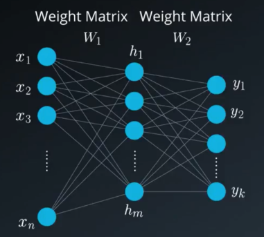

When working with neural networks we have 2 primary phases: Training and Evaluation.
During the training phase, we take the data set (also called the training set), which includes many pairs of inputs and their corresponding targets (outputs). Our goal is to find a set of weights that would best map the inputs to the desired outputs.

In the evaluation phase, we use the network that was created in the training phase, apply our new inputs and expect to obtain the desired outputs.

The training phase will include two steps: Feedforward and Backpropagation.

We will repeat these steps as many times as we need until we decide that our system has reached the best set of weights, giving us the best possible outputs.

As you saw in the video above, vector $\vec{h'}$ of the hidden layer will be calculated by multiplying the input vector with the weight matrix $W^{1}$ the following way:

${\vec{h'}=(\vec{x}W^1)}$

After finding $\vec{h'}$ we need an **activation function** $\Phi$.

This activation function finalizes the computation of the hidden layer's values.

We can use the following two equations to express the final hidden vector $\vec{h'}$:

$\vec{h} = \Phi(\vec{x} W^1 )$

Since $W_{ij}$ represents the weight component in the weight matrix, connecting neuron i from the input to neuron j in the hidden layer, we can also write these calculations using a *linear combination*: (notice that in this example we have n inputs and only 3 hidden neurons):

$h_1=\Phi(x_1W_{11}+x_2W_{21}+...+x_3W_{n1})$
$h_2=\Phi(x_1W_{12}+x_2W_{22}+...+x_3W_{n2})$
$h_3=\Phi(x_1W_{13}+x_2W_{23}+...+x_3W_{n3})$

We finished our first step, finding $\vec{h}$ and now need to find the output $\vec{y}$. The process of calculating the output vector is mathematically similar to that of calculating the vector of the hidden layer. We use, again, a vector by matrix multiplication. The vector is the newly calculated hidden layer and the matrix is the one connecting the hidden layer to the output.
​
Essentially, each new layer in an neural network is calculated by a vector by matrix multiplication, where the vector represents the inputs to the new layer and the matrix is the one connecting these new inputs to the next layer.

**Classification problems**

- Example: student acceptance at a university by analysis of two variables: test score and grades. We draw a model that is a linear boundary given by the equation $2*x_1+x_2-18=0$ to predict the overall score. If score > 0, we accept the student, otherwise reject. That's our model's **prediction.**
- More generally, our model is a equation of the form: $w_1x_1+w_2x_2+b=0$ or $Wx+b=0$. We try to predict the label y, which in this case is either 0 or 1. Our prediction is the output of our model given by $\hat y$.
- $\hat  y = 1 \ if \ Wx+b \ge 0$ and $\hat y = 0 \ if \ Wx+b<0$.
- Our algorithm seeks to find a model where most of our predictions match the labels.
- If we have more dimensions, our boundary will be a hyperplane that is n-1 dimensional.


**Perceptrons**
Functions that combine inputs in some fashion and output a number from 0 to 1. A step function is applied to the prediction of the model.

- Perceptron trick: we draw a random line, find how badly it is doing by "asking the points". For the misclassified points, they want the boundary to move closer to them, in order to eventually classify them correctly. The trick to do so is to add or subtract to the line coordinates some percentage of the points' coordinates. The multiplicative constant is the **learning rate**. The bias is added/subtracted the learning rate. The new line will be closer to the misclassified point.

The logical operators AND, OR, NOT and XOR can be modeled with perceptrons. Check out `perceptrons.py` to see code.

In real life, though, we can't be building these perceptrons ourselves. The idea is that we give them the result, and they build themselves.

Our error function will tell us the direction to go to. We take at each step the direction that will reduce the error the most. Our error function needs to be continuous as opposed to discrete and also differentiable. That is because we are using derivatives to compute steps in our parameters! Then we need to switch to continuous predictions too. We apply the sigmoid function instead of the step function.

So our predictions now need to be continuous as opposed to 0 or 1 only. Now we our model will need to output the likelihood that a point is classified in as a 1. No more "yes" or "no" but "X% likely". The closer to the line the point is, the greater the likelihood. We go from the step function to the **sigmoid** function that ranges from 0 to 1 continuously. The shape of the **activation function** is now given by: $\sigma(x)=1/(1+e^{-x})$ as opposed to a step function as before.

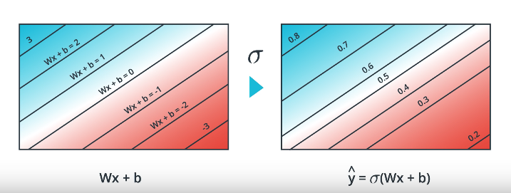

The **softmax function** is used as an activation when there is more than two classes in the classification problem. It has to calculate probabilities that sum to 1. It also has to work with scores that are negative. We use exponential to convert every possible number into a positive number. The softmax formula is: $P(class \ i) = e^{z_i}/(e^{z_1}+e^{z_2}+...+e^{z_n})$. The value of the softmax function for a given input is exactly the same as the sigmoid for that input.

**One-hot encoding** concept: to turn multiple categorical variables into a form that we can feed to ML algos.

**Maximum Likelihood and Cross-Entropy**
The maximum likelihood is the idea of how accurate a model is at classifying most points correctly based on their expected labels. It is related to the product of the probabilities of all points being classified as their respective labels. The result will be higher for a more accurate model.

To make the numbers more "good looking", we transform them by taking the logarithm. The product then turns into sums. So we take the -ln of the product to turn that into a sum of lns. The result of the sum is called **cross-entropy**. A good model will have a low cross entropy ans so now we want to minimize the cross entropy! The cross entropy definitely connects probabilities and error functions. The cross-entropy is inversely proportional to the total probability of an outcome.

The formula is:

$$CE=-\sum_{i=1}^{m}y_iln(p_i)+(1-y_i)ln(1-p_i)$$

Note: We are only summing the probabilities of the events that actually occurred since y is 0 or 1.

For more than two classes we write more generically:

$$CE=-\sum_{i=1}^{n}\sum_{j=1}^{m}y_{ij}ln(p_{ij})$$

Then our error function is:

$$E(W,b)=-\frac{1}{m}\sum_{i=1}^{m}(1-y_i)ln(1-\sigma(Wx^{(i)}+b)+y_iln(\sigma(Wx^{(i)}+b)))$$

Or, the error function for a multivariate classification problem is given by:

$$E(W,b)=-\frac{1}{m}\sum_{i=1}^{m} \sum_{j=1}^{n} y_{ij}ln(\hat y_{ij})=-\frac{1}{m}\sum_{i=1}^{m} \sum_{j=1}^{n} y_{ij}ln[\sigma(Wx^{(i)}+b)]$$

**Gradient Descent**
We use the negative of the gradient of the error function as the direction to go that leads to the greatest decrease in the error function, $-\nabla E$. We use a learning rate $\alpha$ to take not too big of a step. We compute the new weights and bias as:

$$w'_i=w_i-\alpha \frac{\partial E}{\partial w_i}$$

$$b'=b-\alpha\frac{\partial E}{\partial b}$$

which assures that the prediction given by $\hat y=\sigma(W'x+b')$ is better than the former one.

After derivation, we find that the gradient vector is simply given by:
$$\nabla E=-(y-\hat y)(x_1,x_2,...x_n,1)$$
The gradient is actually a scalar times the coordinates of the point! And what is the scalar? Nothing less than a multiple of the difference between the label and the prediction. So, if a point is well classified, we will get a small gradient. And if it's poorly classified, the gradient will be quite large.

The gradient descent step will then be:

$$w_i'=w_i-\alpha [-(y-\hat y)x_i] \ or \ w_i+\alpha (y-\hat y)x_i$$

$$b'=b+\alpha (y-\hat y)$$

Note: Since we've taken the average of the errors, the term we are adding should be $\frac{1}{m} \cdot \alpha$ instead of $\alpha$ but as $\alpha$ is a constant, then in order to simplify calculations, we'll just take $\frac{1}{m} \cdot \alpha$ to be our learning rate, and abuse the notation by just calling it $\alpha$.

The gradient descent algorithm is then as follows:
- Start with random weights
- For every point $(x_1,...,x_n)$ we update the weights and bias: $w'_i=w_i-\alpha (\hat y - y)x_i$ and $b'=b-\alpha(\hat y-y)$.
- We repeat until error is small or for a number of times called epochs.

In the gradient descent even correctly classified points have the line move with respect to them, which is not the case for the perceptron algorithm (correctly classified points don't have their weights changed). These points actually have the line move farther away from them, so as to increase their probability of being correctly classified :)

**Non-linear models**

Let's say we want to combine two linear models to produce a non-linear one. For instance we can sum the outputs of two linear models and apply the sigmoid function to produce a number between 0 and 1. We can use weights to use different proportions of the two models too and have a bias as well.

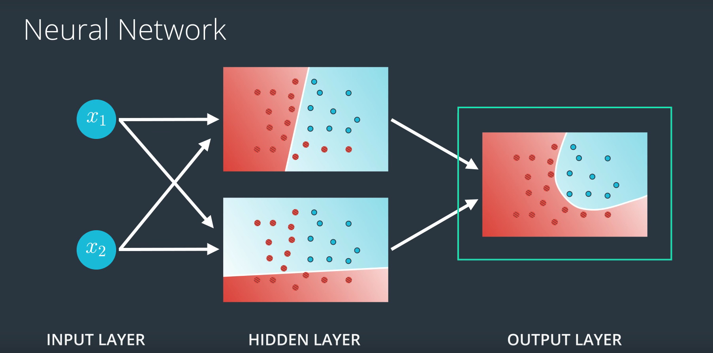

In deep neural networks we have more hidden layers where intermediate non-linear models combine to generate other non-linear models.

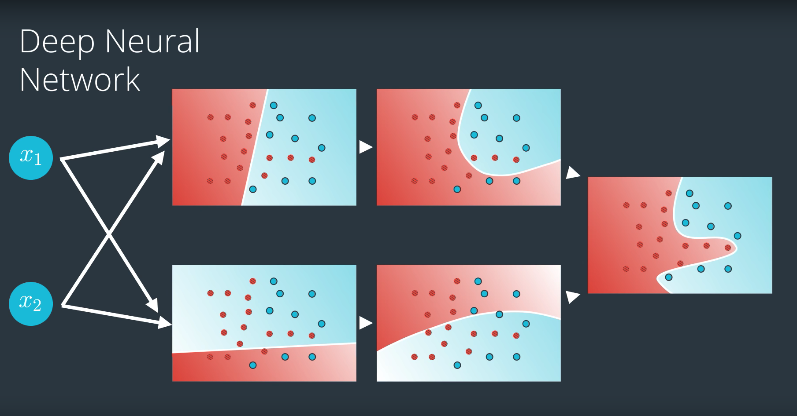

And for multi-class classification, as opposed to binary, we can have multiple neural networks, each one to predict the probability of one of the classes and then apply the softmax function. This seems like overkill though. What we actually do is add more nodes to the output layer and each will be the probability of the input belonging to one of the possible classes. We apply the softmax to the different scores.

**Feedforward**

Process of a neural network to obtain the prediction from the input vector given its architecture.

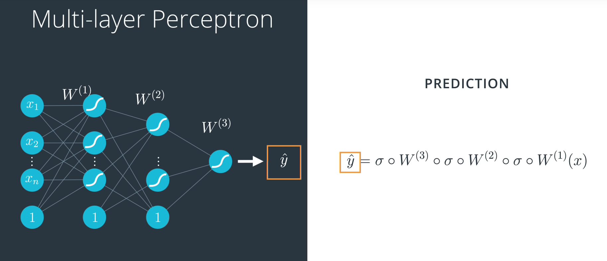

Now, we're ready to get our hands into training a neural network. For this, we'll use the method known as backpropagation. In a nutshell, **backpropagation** will consist of:

- Doing a feedforward operation.
- Comparing the output of the model with the desired output.
- Calculating the error.
- Running the feedforward operation backwards (backpropagation) to spread the error to each of the weights.
- Use this to update the weights, and get a better model.
- Continue this until we have a model that is good.

With backpropagation, we "listen" to the point that was misclassified and weigh in the models differently based on the classification they output with respect to that point.

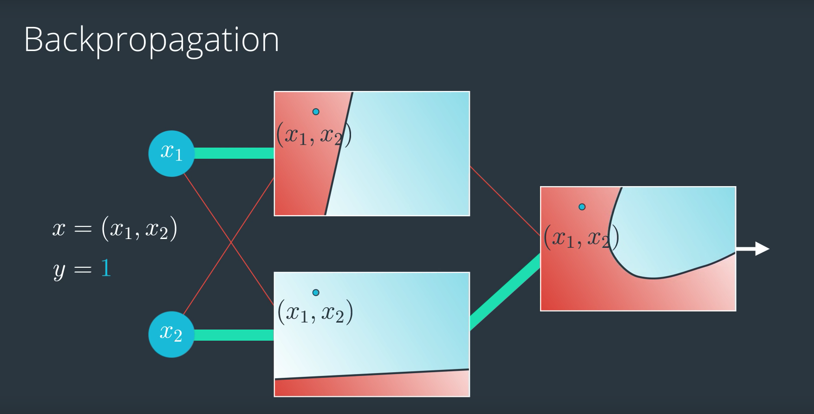

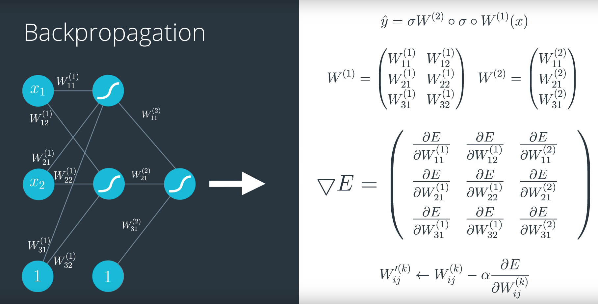

**Gradient Descent with Squared Errors**

Other than the log-loss function, there are many other error functions used for neural networks. Another one is called the mean squared error. As the name says, this one is the mean of the squares of the differences between the predictions and the labels.

We want to find the weights for our neural networks. Let's start by thinking about the goal. The network needs to make predictions as close as possible to the real values. To measure this, we use a metric of how wrong the predictions are, the error. A common metric is the sum of the squared errors (SSE):

$$E=\frac{1}{2}\sum_{\mu}\sum_{j}[y_j^{\mu}-\hat y_j^{\mu}]^2$$

where $\hat y$ is the prediction and y is the true value, and you take the sum over all output units j and another sum over all data points $\mu$. The square ensures the error is always positive and larger errors are penalized more than smaller errors. Also, it makes the math nice, always a plus.

We want the network's prediction error to be as small as possible and the weights are the knobs we can use to make that happen. Our goal is to find weights $w_{ij}$ that minimize the squared error E. To do this with a neural network, typically you'd use gradient descent.

Since the weights will just go wherever the gradient takes them, they can end up where the error is low, but not the lowest. These spots are called local minima. If the weights are initialized with the wrong values, gradient descent could lead the weights into a local minimum.

To calculate the weight step:

$$\frac{\partial E}{\partial w_i}=\frac{\partial}{\partial w_i} \frac{1}{2}(y- \hat y(w_i))^2$$

Applying the chain rule:

$$\frac{\partial E}{\partial w_i}=-(y - \hat y)\frac{\partial \hat y}{\partial w_i}$$

$$\frac{\partial E}{\partial w_i}=-(y - \hat y)f' (h)\frac{\partial}{\partial w_i}\sum w_ix_i \ where \ h=\sum w_ix_i$$

$$\frac{\partial E}{\partial w_i}=-(y - \hat y)f' (h)x_i$$

So we can say that:

$$\Delta w_i = \eta \, \delta x_i$$

with the error term δ as

$$\delta = (y - \hat y) f'(h) = (y - \hat y) f'(\sum w_i x_i)$$

Remember, in the above equation $(y - \hat y)$ is the output error, and $f'(h)$ refers to the derivative of the activation function, f(h). We'll call that derivative the output gradient.

Now I'll write this out in code for the case of only one output unit. We'll also be using the sigmoid as the activation function f(h).

```
# Defining the sigmoid function for activations
def sigmoid(x):
    return 1/(1+np.exp(-x))

# Derivative of the sigmoid function
def sigmoid_prime(x):
    return sigmoid(x) * (1 - sigmoid(x))

# Input data
x = np.array([0.1, 0.3])
# Target
y = 0.2
# Input to output weights
weights = np.array([-0.8, 0.5])

# The learning rate, eta in the weight step equation
learnrate = 0.5

# the linear combination performed by the node (h in f(h) and f'(h))
h = x[0]*weights[0] + x[1]*weights[1]
# or h = np.dot(x, weights)

# The neural network output (y-hat)
nn_output = sigmoid(h)

# output error (y - y-hat)
error = y - nn_output

# output gradient (f'(h))
output_grad = sigmoid_prime(h)

# error term (lowercase delta)
error_term = error * output_grad

# Gradient descent step
del_w = [ learnrate * error_term * x[0],
          learnrate * error_term * x[1]]
# or del_w = learnrate * error_term * x
```

**Implementing the hidden layer**

Now, the weights need to be stored in a matrix. Each row in the matrix will correspond to the weights leading out of a single input unit, and each column will correspond to the weights leading in to a single hidden unit. For our three input units and two hidden units, the weights matrix looks like this.

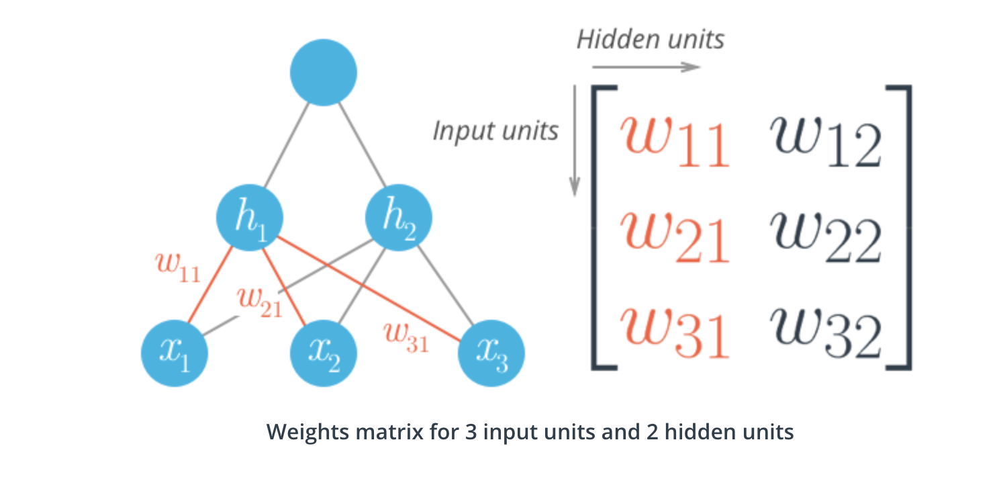

To initialize these weights in NumPy, we have to provide the shape of the matrix. If features is a 2D array containing the input data:

```
# Number of records and input units
n_records, n_inputs = features.shape
# Number of hidden units
n_hidden = 2
weights_input_to_hidden = np.random.normal(0, n_inputs**-0.5, size=(n_inputs, n_hidden))
```

This creates a 2D array (i.e. a matrix) named `weights_input_to_hidden` with dimensions `n_inputs` by `n_hidden`. Remember how the input to a hidden unit is the sum of all the inputs multiplied by the hidden unit's weights. So for each hidden layer unit, $h_j$, we need to calculate the following:
$$h_j=\sum_i w_{ij}xi$$

In NumPy, you can do this for all the inputs and all the outputs at once using np.dot:
`hidden_inputs = np.dot(inputs, weights_input_to_hidden)`

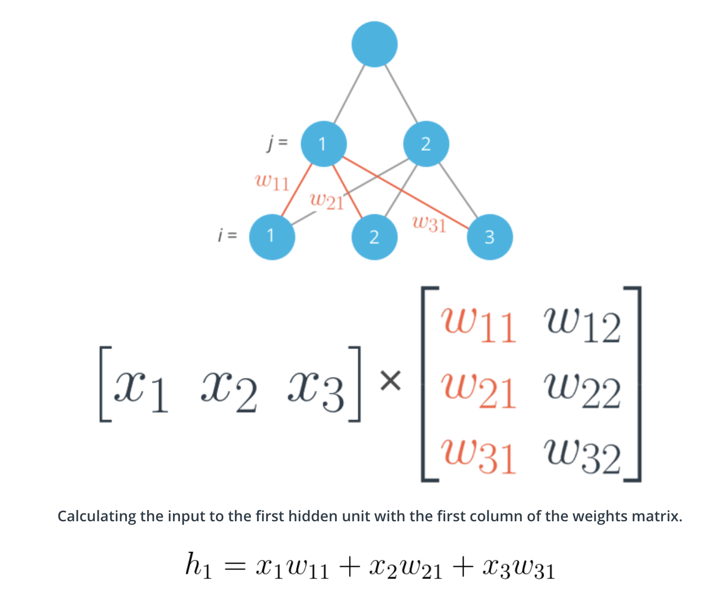

*Making a column vector*

You see above that sometimes you'll want a column vector, even though by default NumPy arrays work like row vectors. It's possible to get the transpose of an array like so arr.T, but for a 1D array, the transpose will return a row vector. Instead, use `arr[:,None]` to create a column vector:

```
print(features)
> array([ 0.49671415, -0.1382643 ,  0.64768854])

print(features.T)
> array([ 0.49671415, -0.1382643 ,  0.64768854])

print(features[:, None])
> array([[ 0.49671415],
       [-0.1382643 ],
       [ 0.64768854]])
```

Alternatively, you can create arrays with two dimensions. Then, you can use `arr.T` to get the column vector.

```
np.array(features, ndmin=2)
> array([[ 0.49671415, -0.1382643 ,  0.64768854]])

np.array(features, ndmin=2).T
> array([[ 0.49671415],
       [-0.1382643 ],
       [ 0.64768854]])
```

**Backpropagation**

Now we've come to the problem of how to make a multilayer neural network **learn**. Before, we saw how to update weights with gradient descent. The backpropagation algorithm is just an extension of that, using the chain rule to find the error with the respect to the weights connecting the input layer to the hidden layer (for a two layer network).

To update the weights to hidden layers using gradient descent, you need to know how much error each of the hidden units contributed to the final output. Since the output of a layer is determined by the weights between layers, the error resulting from units is scaled by the weights going forward through the network. Since we know the error at the output, we can use the weights to work backwards to hidden layers.

For example, in the output layer, you have errors $\delta^o_k$  attributed to each output unit k. Then, the error attributed to hidden unit j is the output errors, scaled by the weights between the output and hidden layers (and the gradient):

$$\delta_j^h=\sum W_{ij}\delta_o^kf'(h_j)$$

Then, the gradient descent step is the same as before, just with the new errors:
$$\Delta w_{ij}=\eta \delta_j^hx_i$$

where $w_{ij}$ are the weights between the inputs and hidden layer and $x_i$ are input unit values. This form holds for however many layers there are. The weight steps are equal to the step size times the output error of the layer times the values of the inputs to that layer

$$\Delta w_{pq}=\eta \delta_{output}V_{in}$$

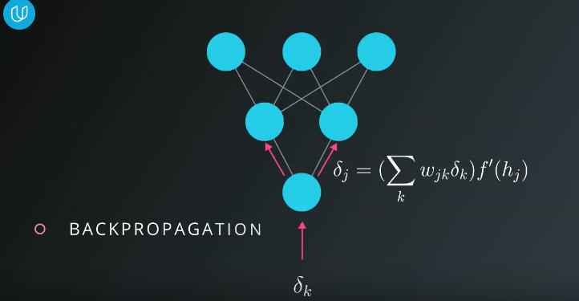

Here, you get the output error, $\delta_{output}$, by propagating the errors backwards from higher layers. And the input values, $V_{in}$ are the inputs to the layer, the hidden layer activations to the output unit for example.

*Working through an example*
Let's walk through the steps of calculating the weight updates for a simple two layer network. Suppose there are two input values, one hidden unit, and one output unit, with sigmoid activations on the hidden and output units. The following image depicts this network. (Note: the input values are shown as nodes at the bottom of the image, while the network's output value is shown as $\hat y$ at the top. The inputs themselves do not count as a layer, which is why this is considered a two layer network.)

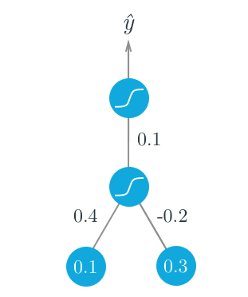

Assume we're trying to fit some binary data and the target is y = 1. We'll start with the forward pass, first calculating the input to the hidden unit

$$h = \sum_i w_i x_i = 0.1 \times 0.4 - 0.2 \times 0.3 = -0.02$$

and the output of the hidden unit

$$a = f(h) = \mathrm{sigmoid}(-0.02) = 0.495$$

Using this as the input to the output unit, the output of the network is

$$\hat y = f(W \cdot a) = \mathrm{sigmoid}(0.1 \times 0.495) = 0.512$$

With the network output, we can start the backwards pass to calculate the weight updates for both layers. Using the fact that for the sigmoid function $f'(W \cdot a) ==f(W⋅a)(1−f(W⋅a))$, the error term for the output unit is

$$\delta^o = (y - \hat y) f'(W \cdot a) = (1 - 0.512) \times 0.512 \times(1 - 0.512) = 0.122$$

Now we need to calculate the error term for the hidden unit with backpropagation. Here we'll scale the error term from the output unit by the weight W connecting it to the hidden unit. For the hidden unit error term, $\delta^h_j = \sum_k W_{jk} \delta^o_k f'(h_j)$, but since we have one hidden unit and one output unit, this is much simpler.

$$\delta^h = W \delta^o f'(h) = 0.1 \times 0.122 \times 0.495 \times (1 - 0.495) = 0.003$$

Now that we have the errors, we can calculate the gradient descent steps. The hidden to output weight step is the learning rate, times the output unit error, times the hidden unit activation value.

$$\Delta W = \eta \delta^o a = 0.5 \times 0.122 \times 0.495 = 0.0302$$

Then, for the input to hidden weights $w_i$, it's the learning rate times the hidden unit error, times the input values.

$$\Delta w_i = \eta \delta^h x_i = (0.5 \times 0.003 \times 0.1, 0.5 \times 0.003 \times 0.3) = (0.00015, 0.00045)$$

From this example, you can see one of the effects of using the sigmoid function for the activations. The maximum derivative of the sigmoid function is 0.25, so the errors in the output layer get reduced by at least 75%, and errors in the hidden layer are scaled down by at least 93.75%! You can see that if you have a lot of layers, using a sigmoid activation function will quickly reduce the weight steps to tiny values in layers near the input. This is known as the vanishing gradient problem. Later in the course you'll learn about other activation functions that perform better in this regard and are more commonly used in modern network architectures.

*Implementing in NumPy*

For the most part you have everything you need to implement backpropagation with NumPy.

However, previously we were only dealing with error terms from one unit. Now, in the weight update, we have to consider the error for each unit in the hidden layer, $\delta_j$:

$$\Delta w_{ij} = \eta \delta_j x_i$$

Firstly, there will likely be a different number of input and hidden units, so trying to multiply the errors and the inputs as row vectors will throw an error:

```
hidden_error*inputs
---------------------------------------------------------------------------
ValueError                                Traceback (most recent call last)
<ipython-input-22-3b59121cb809> in <module>()
----> 1 hidden_error*x

ValueError: operands could not be broadcast together with shapes (3,) (6,)
```

Also, $w_{ij}$ is a matrix now, so the right side of the assignment must have the same shape as the left side. Luckily, NumPy takes care of this for us. If you multiply a row vector array with a column vector array, it will multiply the first element in the column by each element in the row vector and set that as the first row in a new 2D array. This continues for each element in the column vector, so you get a 2D array that has shape `(len(column_vector), len(row_vector))`.

```
hidden_error*inputs[:,None]
array([[ -8.24195994e-04,  -2.71771975e-04,   1.29713395e-03],
       [ -2.87777394e-04,  -9.48922722e-05,   4.52909055e-04],
       [  6.44605731e-04,   2.12553536e-04,  -1.01449168e-03],
       [  0.00000000e+00,   0.00000000e+00,  -0.00000000e+00],
       [  0.00000000e+00,   0.00000000e+00,  -0.00000000e+00],
       [  0.00000000e+00,   0.00000000e+00,  -0.00000000e+00]])
```

It turns out this is exactly how we want to calculate the weight update step. As before, if you have your inputs as a 2D array with one row, you can also do `hidden_error*inputs.T`, but that won't work if inputs is a 1D array.

Backpropagation Exercise:
```
import numpy as np
x = np.array([0.5, 0.1, -0.2])
target = 0.6
learnrate = 0.5

weights_input_hidden = np.array([[0.5, -0.6],
                                 [0.1, -0.2],
                                 [0.1, 0.7]])

weights_hidden_output = np.array([0.1, -0.3])

Forward pass
hidden_layer_input = np.dot(x, weights_input_hidden)
hidden_layer_output = sigmoid(hidden_layer_input)

output_layer_in = np.dot(hidden_layer_output, weights_hidden_output)
output = sigmoid(output_layer_in)

Backwards pass
TODO: Calculate output error
error = target-output

TODO: Calculate error term for output layer
output_error_term = error*output*(1-output)

TODO: Calculate error term for hidden layer
hidden_error_term = np.dot(output_error_term,weights_hidden_output)*hidden_layer_output*(1-hidden_layer_output)

TODO: Calculate change in weights for hidden layer to output layer
delta_w_h_o = learnrate*output_error_term*hidden_layer_output

TODO: Calculate change in weights for input layer to hidden layer
delta_w_i_h = learnrate*hidden_error_term*x[:,None]

Output
Change in weights for hidden layer to output layer:
[0.00804047 0.00555918]
Change in weights for input layer to hidden layer:
[[ 1.77005547e-04 -5.11178506e-04]
 [ 3.54011093e-05 -1.02235701e-04]
 [-7.08022187e-05  2.04471402e-04]]
```

Now we've seen that the error term for the output layer is

$$\delta_k = (y_k - \hat y_k) f'(a_k)$$

and the error term for the hidden layer is

$$\delta_j=\sum[w_{jk} \delta_k]f'(h_j)$$

For now we'll only consider a simple network with one hidden layer and one output unit. Here's the general algorithm for updating the weights with backpropagation:

- Set the weight steps for each layer to zero
    - The input to hidden weights $\Delta w_{ij} = 0$
    - The hidden to output weights $\Delta W_j = 0$
- For each record in the training data:
    - Make a forward pass through the network, calculating the output $\hat y$​
    - Calculate the error gradient in the output unit, $\delta^o = (y - \hat y) f'(z)$ where $z = \sum_j W_j a_j$, the input to the output unit.
    - Propagate the errors to the hidden layer $\delta^h_j = \delta^o W_j f'(h_j)$
    - Update the weight steps:
        - $\Delta W_j = \Delta W_j + \delta^o a_j$
        - $\Delta w_{ij} = \Delta w_{ij} + \delta^h_j a_i$
- Update the weights, where $\eta$ is the learning rate and m is the number of records:
    - $W_j = W_j + \eta \Delta W_j / m$
    - $w_{ij} = w_{ij} + \eta \Delta w_{ij} / m$
- Repeat for e epochs.

```
import numpy as np
from data_prep import features, targets, features_test, targets_test

np.random.seed(21)

n_hidden = 2
epochs = 900
learnrate = 0.005

n_records, n_features = features.shape
last_loss = None
Initialize weights
weights_input_hidden = np.random.normal(scale=1 / n_features ** .5,
                                        size=(n_features, n_hidden))
weights_hidden_output = np.random.normal(scale=1 / n_features ** .5,
                                         size=n_hidden)
for e in range(epochs):
    del_w_input_hidden = np.zeros(weights_input_hidden.shape)
    del_w_hidden_output = np.zeros(weights_hidden_output.shape)
    for x, y in zip(features.values, targets):
        Forward pass
        TODO: Calculate the output
        hidden_input = np.dot(x, weights_input_hidden)
        hidden_output = sigmoid(hidden_input)

        output = sigmoid(np.dot(hidden_output,
                                weights_hidden_output))

        Backward pass
        TODO: Calculate the network's prediction error
        error = y - output

        TODO: Calculate error term for the output unit
        output_error_term = error * output * (1 - output)

        propagate errors to hidden layer

        TODO: Calculate the hidden layer's contribution to the error
        hidden_error = np.dot(output_error_term, weights_hidden_output)

        TODO: Calculate the error term for the hidden layer
        hidden_error_term = hidden_error * hidden_output * (1 - hidden_output)

        TODO: Update the change in weights
        del_w_hidden_output += output_error_term * hidden_output
        del_w_input_hidden += hidden_error_term * x[:, None]

    TODO: Update weights
    weights_input_hidden += learnrate * del_w_input_hidden / n_records
    weights_hidden_output += learnrate * del_w_hidden_output / n_records

    Printing out the mean square error on the training set
    if e % (epochs / 10) == 0:
        hidden_output = sigmoid(np.dot(x, weights_input_hidden))
        out = sigmoid(np.dot(hidden_output,
                             weights_hidden_output))
        loss = np.mean((out - targets) ** 2)

        if last_loss and last_loss < loss:
            print("Train loss: ", loss, "  WARNING - Loss Increasing")
        else:
            print("Train loss: ", loss)
        last_loss = loss

Calculate accuracy on test data
hidden = sigmoid(np.dot(features_test, weights_input_hidden))
out = sigmoid(np.dot(hidden, weights_hidden_output))
predictions = out > 0.5
accuracy = np.mean(predictions == targets_test)
print("Prediction accuracy: {:.3f}".format(accuracy))
```
**Training Neural Networks**

*Underfitting and Overfitting*
Killing godzilla with a flyswatter. Or killing a fly with a bazzoka. Oversimplifying and overcomplicating!

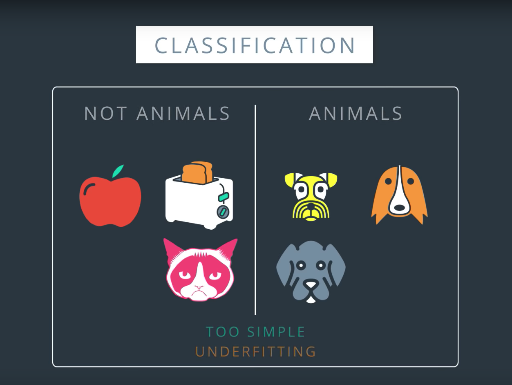
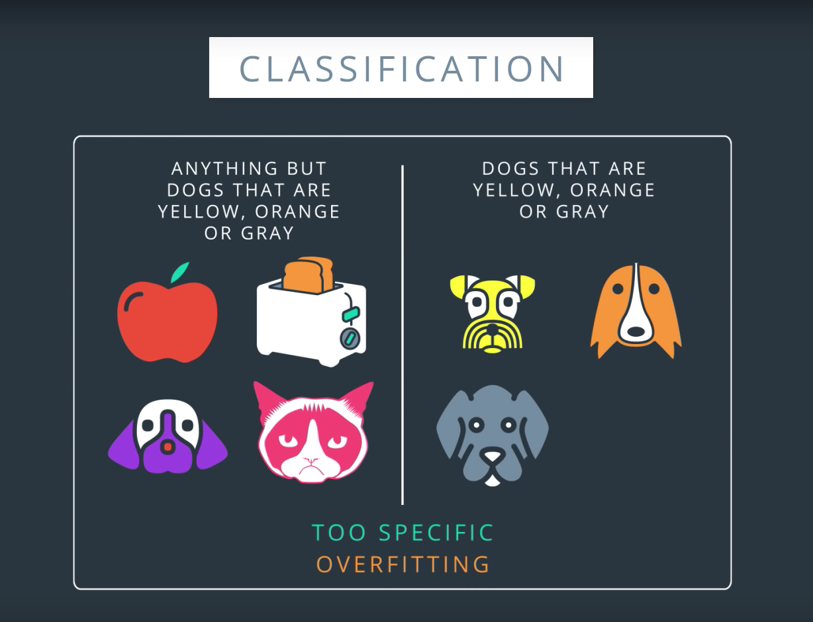
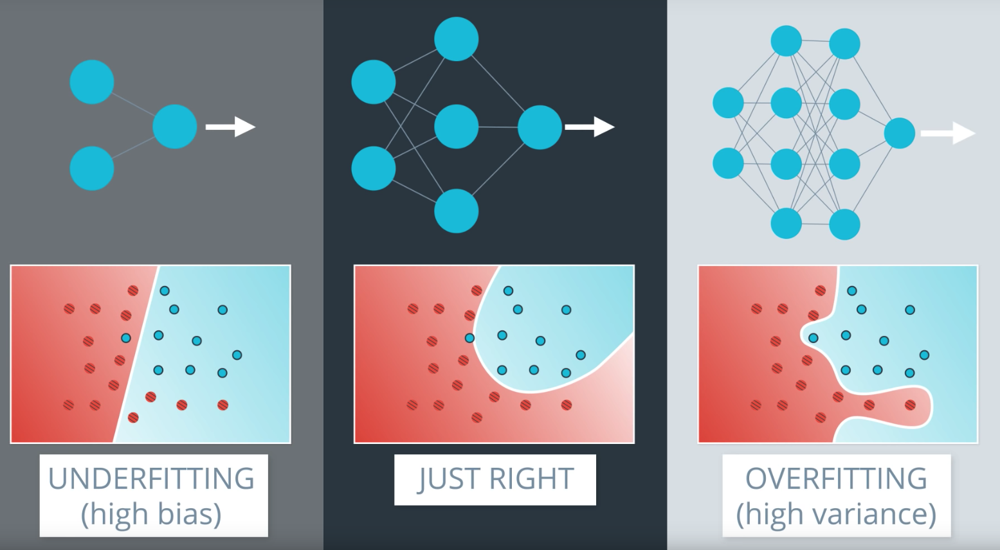

We will tend to overfit as opposed to underfit and apply techniques to fix the overfitting errors. So we prefer to choose an overly complicated architecture and fix it.

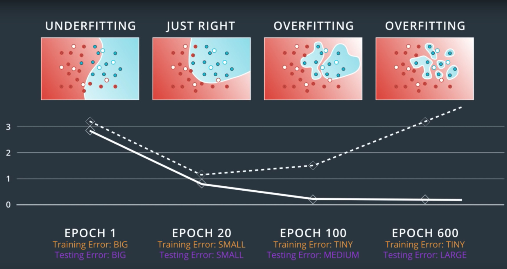
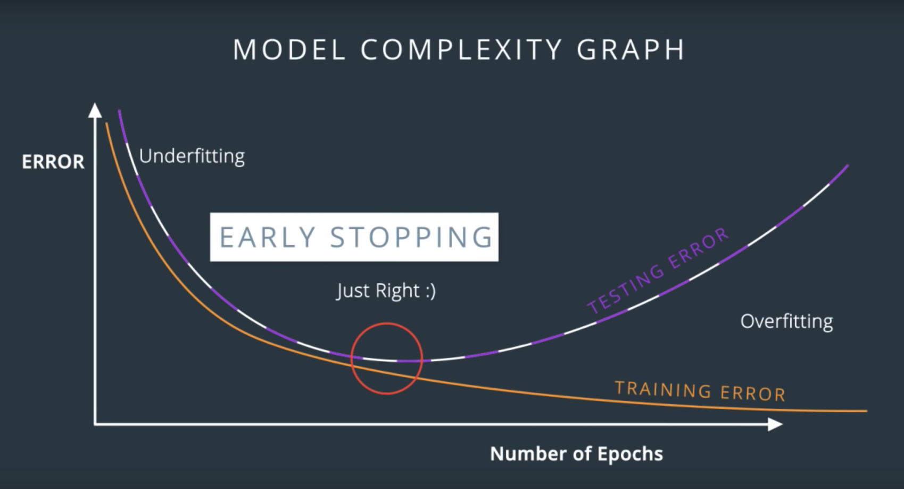

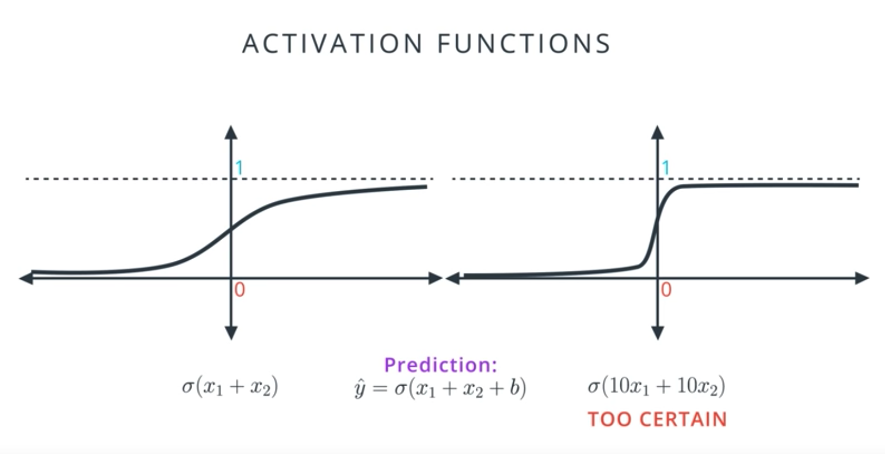
`The whole problem with Artificial Intelligence if that bad models are so certain of themselves, and good models are so full of doubts. [Bertraind Russell]`
Large cofficients --> Overfitting
How to prevent this from happening? We have to tweak the error function to punish large cofficients. This is called **regularization**. Two ways of regularization:


$$-\frac{1}{m}\sum_{i=1}^{m}(1-y_i)ln(\hat y_i)+y_iln(\hat y_i)+\lambda(|w_1|+...+|w_n|)$$


$$-\frac{1}{m}\sum_{i=1}^{m}(1-y_i)ln(\hat y_i)+y_iln(\hat y_i)+\lambda(w_1^2+...+w_n^2)$$

We choose $\lambda$ to penalize more or less.

The regularization L1 leads to higher sparsity in weights vectors and it's good for feature selection.
The regularization L2 leads to smaller sparsity and it's normally better for training models.

**Dropout** is the idea of for some epochs turn off some part of the network that is dominating the training process (larger weights) so that the other parts can pick up the slack. We actually randomly turn off some of the nodes. We give the algorithm a parameter for each node to be turned off. On average each node will have the same importance at the end!

**Random restart** to solve local minima. We start from a few random places and do gradient descent from all of them, increasing the chances of at the end arriving at the global minima or at least a pretty good local minima.

**Vanishing gradient**: with sigmoid activation, which is pretty flat on the sides, the gradient can result in tiny values for the change in the weights. So we change the activation function to, for instance, the hyperbolic tangent function or the rectified linear unit (ReLU):

$$tanhh(x)=\frac{e^x-e{-x}}{e^x+e^{-x}}$$

$$relu(x)=x \ if \ x \ge 0 \ and \ 0 \ if \ x<0$$

Here is the final neural network. Note that the final activation function is still a sigmoid returning an output between 0 and 1.

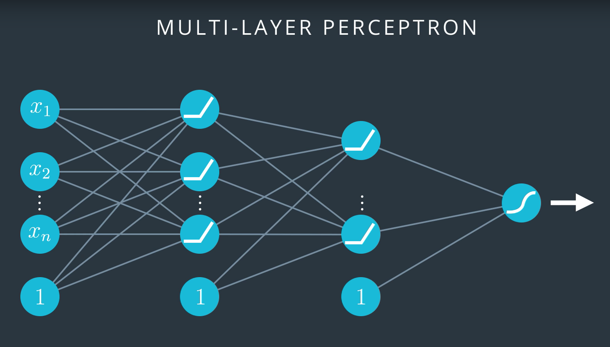

**Stochastic gradient descent** is the idea of not using all data points to compute one step (epoch) but instead choose a small random subset of the data to compute the error gradient and hence update the weights. This will make the algo faster. But we still want to use all the data, and then we split the data into a number of *batches* to make "several bad steps" as opposed to "one good step".

**Learning rate**: if too big, huge steps, may miss the minimum and make the model chaotic. If small, higher chances of arriving at the minima but the algorithm can be quite slow. A good one is one that decreases as the model gets closer to a solution.

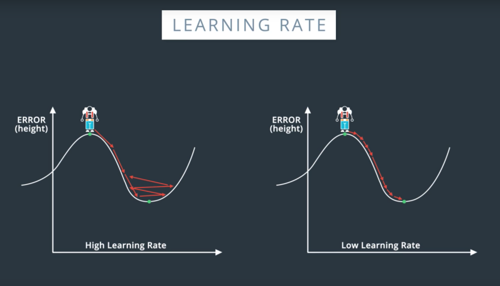

To get over the "hump" (local minima) where the gradient is zero, we can take some weighted average of a few last few steps. We use the **momentum** constant $\beta$ to weigh in each step, to assure that more recent steps matter more. Once we get to the global minima, it pushes us away but not enough to go away from that point. Algos that use momentum tend to perform really well.

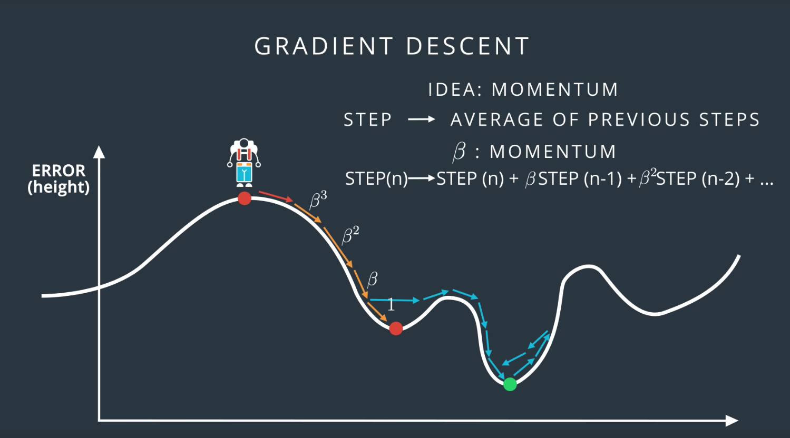

There are other error functions around the world!
